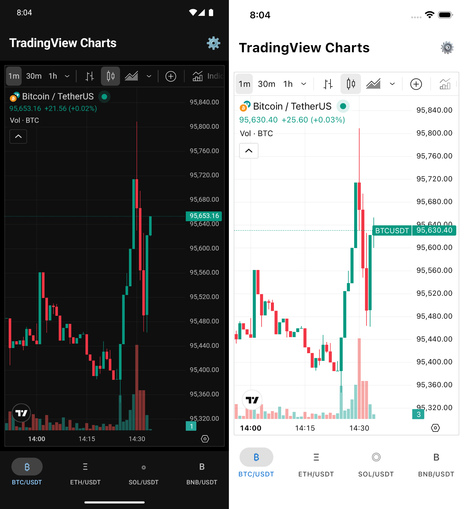
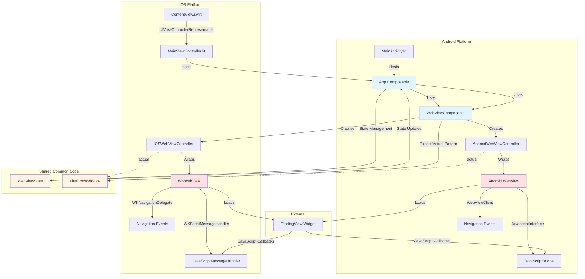

# TradingView WebView App

A Kotlin Multiplatform mobile application that displays TradingView charts for cryptocurrency trading pairs using Compose Multiplatform and native WebView components.



## Tech Stack

### Core Technologies
- **Kotlin Multiplatform Mobile (KMM)**: 2.3.0
- **Compose Multiplatform**: 1.10.0
- **Material 3**: Built-in Compose Material 3 components
- **Coroutines**: 1.8.1 (kotlinx-coroutines-core)
- **Lifecycle**: AndroidX Lifecycle 2.9.6

### Platform-Specific
- **Android**:
  - Android Gradle Plugin: 8.11.2
  - Compile SDK: 36
  - Min SDK: 24
  - Target SDK: 36
  - JVM Target: 11
  - AndroidX Activity Compose: 1.12.2
  - Native `android.webkit.WebView`

- **iOS**:
  - Native `WKWebView` (WebKit)
  - SwiftUI host application
  - UIKitView bridge for Compose integration

### Build Tools
- **Gradle**: Version Catalog (libs.versions.toml)
- **Kotlin Compiler**: Compose Compiler Plugin integrated
- **Xcode**: Required for iOS builds

## Architecture Overview

This application follows a **Kotlin Multiplatform Mobile (KMM)** architecture with shared Compose UI and platform-specific WebView implementations. Android hosts the shared UI in a Compose `Activity`, while iOS hosts it inside a SwiftUI app via a `UIViewControllerRepresentable` bridge.

### Architecture Diagram



### Project Structure

* [/composeApp](./composeApp/src) contains the Kotlin Multiplatform code:
  - [commonMain](./composeApp/src/commonMain/kotlin) - Shared Compose UI and abstractions
  - [androidMain](./composeApp/src/androidMain/kotlin) - Android `actual` implementations
  - [iosMain](./composeApp/src/iosMain/kotlin) - iOS `actual` implementations

* [/iosApp](./iosApp/iosApp) contains the SwiftUI host app for iOS

### Architecture Layers

#### 1. **App Entry Points**
   - **Android** (`androidMain/kotlin/com/androdevlinux/webview/MainActivity.kt`)
     - `MainActivity` hosts Compose and calls `App()`
   - **iOS** (`iosApp/iosApp/ContentView.swift`)
     - SwiftUI `ContentView` embeds `MainViewController()` from Kotlin via `UIViewControllerRepresentable`
   - **Shared UI host** (`iosMain/kotlin/com/androdevlinux/webview/MainViewController.kt`)
     - `MainViewController()` creates the Compose UI for iOS

#### 2. **Presentation Layer** (`commonMain/kotlin/com/androdevlinux/webview/`)
   - **App.kt**: Main composable with Material 3 UI
     - Tab navigation for crypto pairs (BTC, ETH, SOL, BNB)
     - Theme management (Light/Dark/System) and TradingView theme parameter
     - Loading and error state handling from WebView state callbacks
     - Settings dialog with theme selection
   - **ThemeUtils.kt**: Expect/actual system theme detection
     - `getSystemDarkTheme()` implemented per platform

#### 3. **WebView Abstraction Layer** (`commonMain/kotlin/com/androdevlinux/webview/webview/`)
   - **WebViewState.kt**
     - `WebViewLoadingState`: `IDLE`, `LOADING`, `LOADED`, `ERROR`
     - `WebViewState`: URL, navigation flags, error message
   - **WebViewController.kt** (expect class)
     - Common interface for WebView operations (`loadUrl`, `evaluateJavaScript`, navigation, etc.)
     - Factory: `createWebViewController()`
   - **WebViewComposable.kt**
     - High-level Compose component that wires `PlatformWebView` and `WebViewController`
     - Registers JavaScript interfaces and emits `WebViewState` updates
     - Uses `PlatformWebView` expect/actual composable
     - Manages lifecycle with `LaunchedEffect` and `DisposableEffect`

#### 4. **Platform-Specific Implementations**

   **Android** (`androidMain/kotlin/com/androdevlinux/webview/webview/AndroidWebView.kt`)
   - Uses Android `WebView` inside `AndroidView` composable
   - JavaScript bridge via `@JavascriptInterface` annotation
   - `WebViewClient`/`WebChromeClient` for navigation and error handling
   - Web settings: JS enabled, DOM storage, zoom controls, mixed content support
   - Thread-safe URL loading with `post()` and `postDelayed()`

   **iOS** (`iosMain/kotlin/com/androdevlinux/webview/webview/IOSWebView.kt`)
   - Uses `WKWebView` inside `UIKitView` composable
   - JavaScript bridge via `WKScriptMessageHandler` protocol
   - `WKNavigationDelegate` for navigation and error handling
   - Injected bridge script for native callbacks
   - Proper cleanup of message handlers on dispose

### Data Flow

```
User Interaction (Tab Selection/Theme Toggle)
    ↓
App.kt (State + Theme Management)
    ↓
WebViewComposable (URL load + state callbacks)
    ↓
WebViewController (Platform-specific expect/actual)
    ↓
Native WebView (Android WebView / iOS WKWebView)
    ↓
State Updates → WebViewState → App.kt (UI Updates)
    ↓
Material 3 UI Components (Loading, Error, Charts)
```

### Key Features

1. **Multi-platform WebView**: Unified API across Android and iOS using expect/actual pattern
2. **JavaScript Bridge**: Bidirectional communication between web content and native code
   - Android: `@JavascriptInterface` with `JavaScriptBridge` class
   - iOS: `WKScriptMessageHandler` with injected bridge script
3. **State Management**: Reactive state updates for loading, errors, and navigation using Compose state
4. **Theme Support**: Light, Dark, and System theme modes with Material 3 theming
5. **Tab Navigation**: Quick switching between crypto trading pairs (BTC, ETH, SOL, BNB)
6. **Error Handling**: User-friendly error messages and loading indicators
7. **Lifecycle Management**: Proper cleanup and resource management with `DisposableEffect`

### Platform-Specific Implementation Details

**Android:**
- Uses `android.webkit.WebView` with `AndroidView` composable
- JavaScript interfaces via `@JavascriptInterface` annotation
- `WebViewClient` for page lifecycle events (`onPageStarted`, `onPageFinished`, `onReceivedError`)
- `WebChromeClient` for additional browser features
- Web settings configured: JavaScript enabled, DOM storage, zoom controls, mixed content allowed
- Thread-safe operations using `post()` and `postDelayed()` for URL loading

**iOS:**
- Uses `WKWebView` from WebKit framework with `UIKitView` composable
- Message handlers via `WKScriptMessageHandler` protocol
- `WKNavigationDelegate` for navigation events (`didStartProvisionalNavigation`, `didFinishNavigation`, `didFailNavigation`)
- JavaScript injection at document start for bridge setup
- Proper cleanup of message handlers to prevent memory leaks

## Screenshots


The app displays TradingView charts for multiple cryptocurrency trading pairs with a modern Material 3 UI, supporting both Android and iOS platforms.

## Technical Implementation Details

### Expect/Actual Pattern

The project uses Kotlin's expect/actual mechanism to provide platform-specific implementations:

- **WebViewController**: Common interface (`expect`) with platform-specific implementations (`actual`)
- **PlatformWebView**: Platform-specific composable implementations
- **ThemeUtils**: Platform-specific theme detection

### State Management

- Uses Compose's `remember` and `mutableStateOf` for local state
- `WebViewState` flows from platform WebView → `WebViewController` → `WebViewComposable` → `App.kt`
- Reactive updates trigger UI recomposition automatically

### JavaScript Bridge Architecture

**Android Implementation:**
```kotlin
@JavascriptInterface
fun postMessage(message: String)
```
- JavaScript calls: `NativeBridge.postMessage("message")`
- Native receives via `JavaScriptBridge` handler

**iOS Implementation:**
```javascript
window.NativeBridge = {
    postMessage: function(message) {
        window.webkit.messageHandlers.NativeBridge.postMessage(message);
    }
};
```
- Injected at document start via `WKUserScript`
- JavaScript calls: `NativeBridge.postMessage("message")`
- Native receives via `WKScriptMessageHandler`

### TradingView Integration

The app loads TradingView widget embeds with dynamic theme parameters:
- URL format: `https://www.tradingview.com/widgetembed/?symbol={SYMBOL}&theme={light|dark}`
- Supported symbols: `BINANCE:BTCUSDT`, `BINANCE:ETHUSDT`, `BINANCE:SOLUSDT`, `BINANCE:BNBUSDT`
- Theme syncs with app's Material 3 theme

### Dependencies

**Common Main:**
- `compose.runtime` - Compose runtime
- `compose.foundation` - Foundation components
- `compose.material3` - Material 3 components
- `compose.ui` - UI components
- `compose.components.resources` - Resource management
- `androidx.lifecycle.viewmodelCompose` - Lifecycle integration
- `androidx.lifecycle.runtimeCompose` - Runtime lifecycle
- `kotlinx-coroutines-core:1.8.1` - Coroutines support

**Android Main:**
- `androidx.activity.compose` - Activity Compose integration
- `compose.preview` - Preview support

**iOS:**
- Native WebKit framework (no external dependencies)

## Build and Run

### Prerequisites

- **Android**: Android Studio or IntelliJ IDEA with Android plugin
- **iOS**: Xcode 14+ (macOS only)
- **Kotlin**: 2.3.0+
- **Gradle**: Included wrapper (no manual installation needed)

### Build and Run Android Application

To build and run the development version of the Android app:

**Using IDE:**
- Use the run configuration from the run widget in your IDE's toolbar
- Select the Android target device/emulator

**Using Terminal:**
- On macOS/Linux:
  ```shell
  ./gradlew :composeApp:assembleDebug
  ```
- On Windows:
  ```shell
  .\gradlew.bat :composeApp:assembleDebug
  ```

**Install APK:**
```shell
adb install composeApp/build/outputs/apk/debug/composeApp-debug.apk
```

### Build and Run iOS Application

**Using IDE:**
- Use the run configuration from the run widget in your IDE's toolbar
- Ensure you have a valid iOS development certificate configured

**Using Xcode:**
1. Open the [/iosApp](./iosApp) directory in Xcode
2. Select your target device or simulator
3. Build and run (⌘R)

**Using Terminal:**
```shell
cd iosApp
xcodebuild -workspace iosApp.xcworkspace -scheme iosApp -configuration Debug -sdk iphonesimulator
```

### Build Configuration

The project uses Gradle Version Catalog (`gradle/libs.versions.toml`) for dependency management:
- Centralized version definitions
- Type-safe dependency access
- Easy version updates

## Project Structure Details

```
Web View/
├── composeApp/                    # Kotlin Multiplatform module
│   ├── src/
│   │   ├── commonMain/            # Shared code
│   │   │   ├── kotlin/
│   │   │   │   └── com/androdevlinux/webview/
│   │   │   │       ├── App.kt                    # Main UI composable
│   │   │   │       ├── theme/                    # Theme utilities
│   │   │   │       └── webview/                  # WebView abstraction
│   │   │   │           ├── WebViewState.kt       # State model
│   │   │   │           ├── WebViewController.kt  # Expect interface
│   │   │   │           └── WebViewComposable.kt  # High-level composable
│   │   │   └── composeResources/  # Shared resources
│   │   ├── androidMain/           # Android-specific code
│   │   │   ├── kotlin/
│   │   │   │   └── com/androdevlinux/webview/
│   │   │   │       ├── MainActivity.kt           # Android entry point
│   │   │   │       └── webview/
│   │   │   │           └── AndroidWebView.kt     # Android WebView implementation
│   │   │   ├── res/               # Android resources
│   │   │   └── AndroidManifest.xml
│   │   └── iosMain/               # iOS-specific code
│   │       └── kotlin/
│   │           └── com/androdevlinux/webview/
│   │               ├── MainViewController.kt    # iOS UI host
│   │               └── webview/
│   │                   └── IOSWebView.kt        # iOS WKWebView implementation
│   └── build.gradle.kts           # Module build configuration
├── iosApp/                         # iOS host application
│   └── iosApp/
│       ├── ContentView.swift       # SwiftUI entry point
│       ├── iOSApp.swift            # App delegate
│       └── Info.plist              # iOS configuration
├── gradle/
│   └── libs.versions.toml         # Version catalog
├── build.gradle.kts               # Root build configuration
└── settings.gradle.kts            # Project settings
```

## Development Notes

### Adding New Trading Pairs

Edit `TabItem` enum in `App.kt`:
```kotlin
enum class TabItem(val title: String, val symbol: String) {
    BTC("BTC/USDT", "BINANCE:BTCUSDT"),
    ETH("ETH/USDT", "BINANCE:ETHUSDT"),
    // Add new pairs here
}
```

### Customizing Theme

Modify `AppTheme` composable in `theme/` package to customize Material 3 color schemes.

### Extending JavaScript Bridge

Add new interfaces in `WebViewComposable`:
```kotlin
javascriptInterfaces = mapOf(
    "NativeBridge" to { message -> /* handler */ },
    "NewInterface" to { message -> /* new handler */ }
)
```

## Troubleshooting

### Android Issues
- **WebView not loading**: Check internet permissions in `AndroidManifest.xml`
- **JavaScript errors**: Ensure `javaScriptEnabled = true` in WebView settings
- **Mixed content**: Already enabled in current configuration

### iOS Issues
- **Build errors**: Ensure Xcode command-line tools are installed
- **Simulator issues**: Try cleaning build folder (⌘⇧K in Xcode)
- **WebView not displaying**: Check `Info.plist` for required permissions

## Learn More

- [Kotlin Multiplatform Mobile Documentation](https://www.jetbrains.com/help/kotlin-multiplatform-dev/get-started.html)
- [Compose Multiplatform](https://www.jetbrains.com/lp/compose-multiplatform/)
- [Material 3 Design](https://m3.material.io/)
- [TradingView Widgets](https://www.tradingview.com/widget-docs/)
